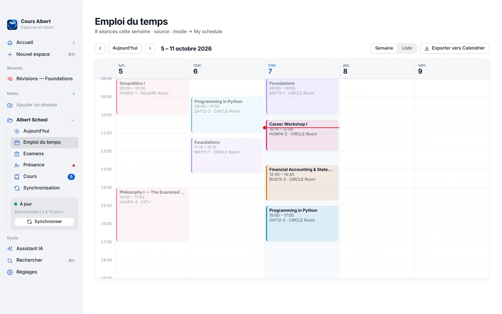
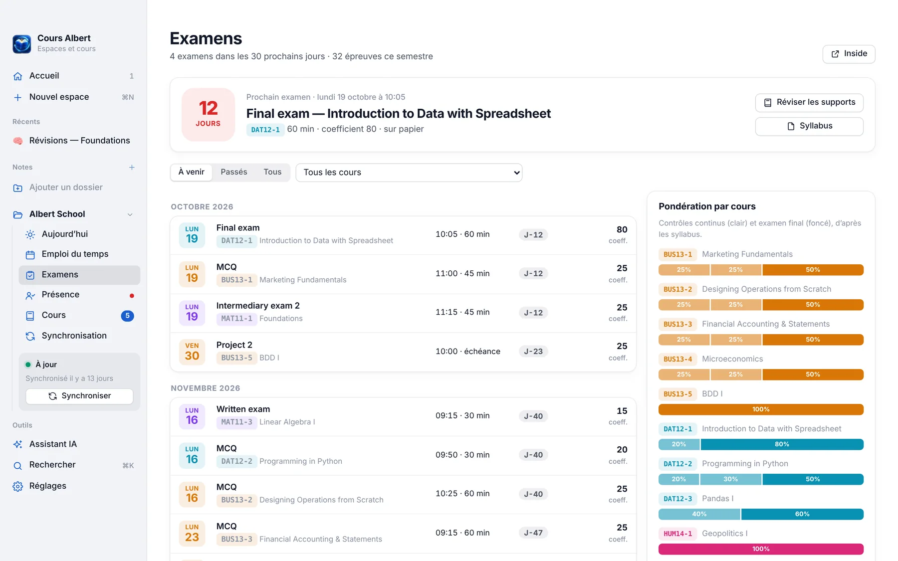

<a href="https://tomabanicevic.github.io/cours-albert/"></a>

<p align="center">
  <a href="https://github.com/tomabanicevic/cours-albert/releases/latest/download/Cours-Albert-3.3.2-macOS.zip"></a>
  <a href="https://tomabanicevic.github.io/cours-albert/"></a>
</p>
<p align="center">
  
  
  
  
</p>

<p align="center">
  <b>L'app Mac des étudiants d'Albert School.</b><br>
  Tes cours rangés dans l'ordre, ton emploi du temps, tes examens et ta présence lus sur Inside,<br>
  et des espaces de travail partagés pour réviser à plusieurs. Gratuite, sans compte, tout reste sur ton Mac.
</p>

---

<table>
  <tr>
    <td width="50%" valign="top"><br><b>Emploi du temps</b><br>Ta semaine avec les salles, exportable vers Calendrier.</td>
    <td width="50%" valign="top"><br><b>Examens</b><br>Dates, durées, coefficients et compte à rebours avant chaque épreuve.</td>
  </tr>
</table>

## 📒 Espaces collaboratifs

- **Tableaux** façon Padlet : texte (Markdown léger et formules LaTeX), images, vidéos, fichiers, liens avec aperçu, dessins, enregistrements audio, vidéo et écran, sondages, lieux et dates. Glisser-déposer et collage d'images.
- **8 dispositions** du même contenu : mur, colonnes, grille, tableau de données, flux, chronologie, carte du monde et disposition libre avec flèches.
- **Espaces libres** : des cartes de tableau blanc avec stylo, formes, notes, flèches, autocollants et objets cliquables qui mènent à d'autres cartes (quiz, parcours).
- **Partage sans compte** par lien ou QR code, pour les personnes sur le même Wi-Fi. Rôles : lecture, commentaire, dépôt, contribution, modération, administration. Collaboration en temps réel.
- **Dessiner partout** : stylo, surligneur et texte libre par-dessus n'importe quel tableau.
- **Exports** : PDF, PNG, CSV, Excel (plusieurs feuilles), ZIP de tous les fichiers, sauvegarde `.coursalbert` réimportable. 14 modèles de tableaux et 6 d'espaces libres.

## 🎓 Albert School

- **Aujourd'hui**, **Emploi du temps** (export `.ics`), **Examens** (dates, coefficients), **Présence** (taux par unité et absences encore possibles avant le seuil de 85 %), lus sur Inside et mis à jour chaque heure, même app fermée.
- **Cours** : les supports d'Inside, de Google Drive et du Bureau, **rangés par catégorie et dans l'ordre** (cours et slides, TD/TP, contrôles, projets, lectures, données et code) : TD1 avant TD2, le corrigé juste après son sujet. Tout se réordonne à la main.
- **Notes Markdown** : l'app ouvre et modifie les `.md` avec le rendu d'Obsidian (encadrés, `[[liens]]`, formules, cases à cocher), ainsi que les fichiers texte, CSV, JSON et notebooks.

## ✨ Assistant IA, seulement si tu veux

Avec ta propre clé (Claude, ChatGPT, Gemini, Mistral, DeepSeek, Grok, Groq, OpenRouter, Ollama en local ou toute API compatible OpenAI), l'assistant range tes cours dans ton vault, tes dossiers de notes et tes espaces. Il n'a **aucun outil de suppression** et chaque demande s'annule d'un clic. Sans clé, l'app fonctionne entièrement.

## ⬇️ Installer

1. Télécharge **[Cours-Albert-3.3.2-macOS.zip](https://github.com/tomabanicevic/cours-albert/releases/latest/download/Cours-Albert-3.3.2-macOS.zip)** (toutes les versions dans les **[Releases](../../releases)**).
2. Double-clique sur le zip, puis glisse **Cours Albert** dans **Applications**.
3. Premier lancement : l'app n'est pas notarisée par Apple. Va dans **Réglages Système › Confidentialité et sécurité** et clique **Ouvrir quand même** (une seule fois).
   <sub>Si macOS dit que l'app est endommagée : `xattr -dr com.apple.quarantine "/Applications/Cours Albert.app"`</sub>
4. L'écran de bienvenue demande où ranger tes cours, puis ouvre Chrome une seule fois pour te connecter à Inside avec Google. Le vault Obsidian et Google Drive pour ordinateur sont facultatifs.

## 🔒 Confidentialité

Tout reste sur ton Mac, dans `~/Library/Application Support/Cours Albert Sync` : session Inside, espaces, classement des cours, clé d'IA éventuelle (lisible par toi seul). **Aucune clé API, aucun compte, aucun mot de passe n'est intégré à l'app** : un ami qui la télécharge part de zéro.

## 🛠 Développer

```bash
git clone https://github.com/tomabanicevic/cours-albert
cd cours-albert/src && npm install && cd ..
bash build.sh          # app universelle signée localement + DMG à partager
node tests/espaces.test.mjs   # tests (voir aussi tests/*.test.mjs)
```

Il faut les outils en ligne de commande de Xcode (`xcode-select --install`). `build.sh` télécharge Node.js 24 et vérifie son empreinte.

Pour travailler sur l'interface sans compiler, avec des données de démonstration :

```bash
node src/espaces/server.mjs --dev --support /tmp/ca-dev --ui src/ui --port 47900
# puis ouvrir http://127.0.0.1:47900/app/index.html?token=dev#/accueil
```

L'architecture (app Cocoa `src/App.m`, interface web `src/ui/`, serveur des espaces `src/espaces/`, moteur de synchronisation `src/sync.mjs`) est décrite dans **[DEVELOPPEMENT.md](DEVELOPPEMENT.md)**.

```
src/App.m        app macOS (fenêtre, menus, barre des menus, pont JavaScript)
src/ui/          interface
src/espaces/     serveur local des espaces, IA, assistant, exports
src/*.mjs        lecture d'Inside, tri des cours, synchronisation
tests/           tests (les données de test sont anonymisées)
docs/            le site (GitHub Pages)
```

## Licence

MIT © 2026 Toma. Outil étudiant **non officiel**.
